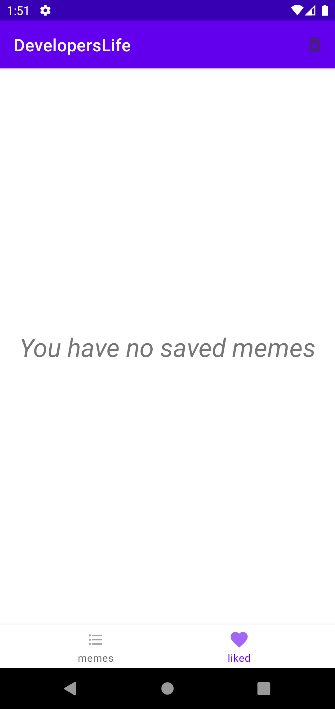

# DevelopersLife

### <u>Описание</u>
Приложение для просмотра gif-мемов с сайта <u>*<a href=https://developerslife.ru/>developerslife.ru</a>*</u> из разных категорий сайта.

### <u>Использование</u>

При запуске приложения пользователь сможет листать список со **случайными мемами с сайта**, но при желании сможет всегда сменить на одну из других **трех категорий**:
- `Latest`
- `Hot`
- `Top`

На понравившееся мемы можно поставить лайк при помощи **двойного клика по изображению**.

Понравившееся мемы отправляются в отдельную категорию `liked` снизу, где их можно будет просмотеть. Если захочется удалить что-то из понравившегося, то нужно **удержать палец на конкретном элементе** или же восполльзоваться конпокой `delete all` в меню сверху, которая **удалит все сохраненные**.

​​

